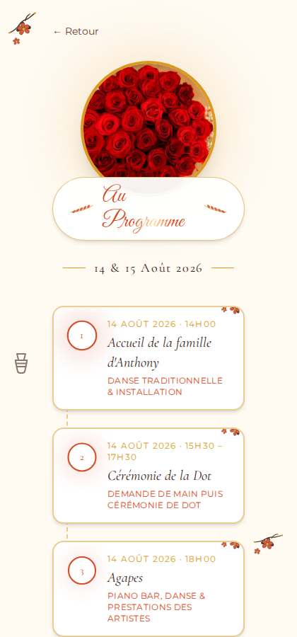
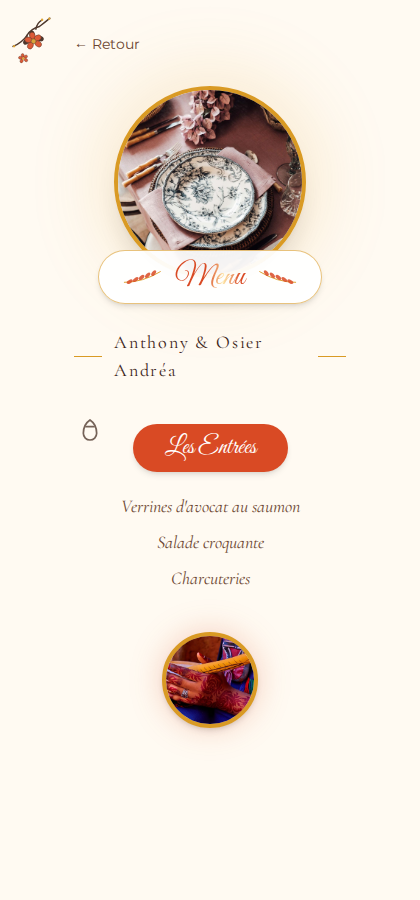

# Anthony & Osier Andréa · Site de mariage

Site d'invitation numérique pour le mariage d'**Anthony & Osier Andréa**, célébré les **14 et 15 août 2026** à Yaoundé, Cameroun.

🔗 **Site en ligne** : [mariage-anthony-osier.netlify.app](https://mariage-anthony-osier.netlify.app)

## Aperçu

<table>
  <tr>
    <td></td>
    <td></td>
    <td></td>
    <td></td>
  </tr>
  <tr>
    <td align="center">Ouverture</td>
    <td align="center">Accueil</td>
    <td align="center">Programme</td>
    <td align="center">Menu</td>
  </tr>
</table>

## Fonctionnalités

- **Écran d'ouverture animé** en forme d'enveloppe, avec effet d'ouverture et fond en tissu doré animé
- **Page d'accueil** : photo du couple, compte à rebours en direct, citation, menu de navigation
- **Page Programme** (`/programme`) : déroulé horaire du 14 août (accueil, dot, agapes) et réception du 15 août, dress-code, bouton "Ajouter à mon calendrier" et partage WhatsApp
- **Page Menu** (`/menu`) : menu complet du mariage par catégories (entrées, plats chauds, accompagnements, desserts)
- **Lieu** : adresses avec lien Google Maps
- **Contacts** : numéros cliquables (appel direct)
- **Cadeaux** : Orange Money, lien Revolut, mention du panier sur place
- Thème visuel inspiré des traditions africaines et des couleurs du pagne (marron, crème, corail, moutarde), 100% responsive (mobile, tablette, PC)

## Stack technique

- [React](https://react.dev/) + [Vite](https://vite.dev/)
- [React Router](https://reactrouter.com/) pour la navigation entre pages
- [Tailwind CSS](https://tailwindcss.com/) pour le style
- [Framer Motion](https://motion.dev/) pour les animations
- Déployé sur [Netlify](https://www.netlify.com/)

## Développement local

```bash
npm install
npm run dev
```

Le site est disponible sur `http://localhost:5173`.

### Build de production

```bash
npm run build
```

Les fichiers sont générés dans le dossier `dist/`.

## Déploiement

Le site est déployé automatiquement sur Netlify à partir du dossier `dist/`. Le fichier `public/_redirects` gère les routes côté client (`/programme`, `/menu`) pour que la navigation directe et le rafraîchissement de page fonctionnent correctement.
